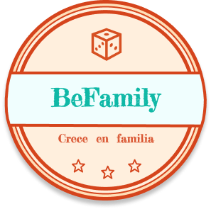

# Bienvenidos de BeFamily
## Una aplicación para toda la familia

## Tabla de contenido

-[Introducción](#introducción) 🌍

-[Stack Tecnológico](#StackTecnológico) ⚒

-[Descripción](#Descripción) 🌷

-[Usabilidad](#Usabilidad) 👔

-[Rutas de la web](#Rutas) 🥨

-[Base de datos](#BaseDeDatos) 🥑

-[Instalación](#Instalación) 🍕

-[Autora](#Autora) 👩‍🦰

-[Como ayudar](#ComoAyudar) 🤞

-[Agradecimientos](#Agradecimientos) 👏


## Introducción 🌍
---
Este es un proyecto que nos han mandado desde la academia, consta de crear una aplicación entera (MVP) con una API RESTful a una base de datos que en este caso he utilizado PHP con laravel y MySQL, y un front con Javascript y React.

El tema era libre de elección y yo elegí mi proyecto final de mi master de UX/UI, pienso que sería una buena oportunidad de aprendizaje para mí el poder comenzar un proyecto desde una idea sin nada a comenzar a investigar sobre ello, estudio de mercado de la necesidad mediante encuestas y entrevistas, obtención de Insights,  muchos canvas, seguido del diseño en Figma, montar un prototipo con todas la funcionalidades de la aplicación hasta el poder darle "vida" al proyecto, tener una api que haga las funcionalidades que tu necesites y  hacer que funcione de verdad y subirlo a producción para que lo puedan utilizar amigos y compañeros.


## Stack Tecnológico ⚒
---
Las tecnologías utilizadas para la realización del Front han sido:

<p align="left">
<a href="https://desarrolloweb.com/home/html" target="_blank">
    </a>
<a href="https://developer.mozilla.org/en-US/docs/Web/JavaScript" target="_blank">
    </a>

<a href="https://reactjs.org/" target="_blank">
    </a>

<a href="https://www.tutorialspoint.com/redux/redux_devtools.htm" target="_blank">
    </a>

<a href="https://developer.mozilla.org/es/docs/Web/CSS" target="_blank">
    </a>
</p>

Además de ha hecho uso de las siguientes librerías/herramientas/tecnologías para el desarrollo del proyecto:

* Entorno: `Node.js`
* ORM: `MySQL`
* Librería de estilos: `Bootstrap`, `Bootswatch`
* Herramienta de despliegue de proyecti Front: `AWS`.


## Descripción 🌷
---
Esto es un aplicación como había comentado en la introducción para que participen toda la familia, consta de elaborar retos entre todos los miembros de la familia o entre ellos, se elaboran los retos a cumplir y se le asigna una recompensa que se hará realidad una vez hayan cumplido el reto, los miembros de la familia se comprometen a cumplir tanto los retos como las recompensas asignadas. 
Esto ayuda a que los padres incentiven a los hijos a hacer cosas que no sea abrazar a un dispositivo electrónico cuando los padres estén ocupados, ayudarles a coger una rutina en la casa para que ayuden a hacer las tareas o simplemente a que aprendan a ser independientes consigo mismo, ejemplo: hacerse la cama todas las mañanas, recoger la mesa después de comer, ayudar a lavar los platos, etc..... 
Es verdad de que hay muchos niños que ya lo hacen de por sí pero también hay muchos que no y después de nuestras investigaciones nos hemos dado cuenta de que los niños tienden a hacer más cosas con más ganas con una simple recompensa como la de llevarles al cine el fin de semana para ver una peli que les gusta o una hamburguesa en el restaurante.
Aunque sea un reto temporal con el tiempo el niñ@ acaba cogiendo buenas costumbres.


## Usabilidad 👔
---
Esta aplicación en el proceso inicial consta de las siguientes vistas y funcionalidades:

* Vista Registro en la ruta `/register`donde cualquier persona puede registrarse con:

```html
Nombre de la familia:
Tu Nombre:
Tu fecha de nacimiento:
Correo electrónico:
Contraseña:
```

* Vista Login está en la ruta `/login` donde el usuario tiene que introducir su email y su contraseña para poder acceder a la aplicación, si todavía no se ha registrado hay un enlace que redirecciona al registro. Una vez que ha hecho login, se redirecciona a la home para poder visualizar los retos.

```html
Correo electrónico:
Contraseña:
```

* Vista Home en la ruta `/home` están la lista de todos los retos, que podrás editar, borrar o simplemente ver detalles de esta con solo clickar encima de la tarjeta.

* Header: Arriba a la izquierda esta el nombre y el logo de la aplicación que redirecciona de donde estés a la /home, luego tienes los botones de retos donde están tus retos, el botón de recompensas donde están todas las recompensas registradas.

* En la barra de header también esta el botón de ajustes que te lleva a tu perfil en la ruta `/profile` con tus datos personales y los miembros de tu familia;
En esta vista podrás editar tus datos y editar o añadir miembros de tu familia.

```html
CREACIÓN DE UN MIEMBRO
nombre:
fecha de nacimiento:
Correo electrónico:
Contraseña:
```

* Vista de creación de un reto en la ruta `/createChallenge` tienes el formulario para crear un nuevo reto:

```html
CREACIÓN DE UN NUEVO RETO
Elegir los miembros que van a participar:
Nombre del reto:
Elegir el número de repeticiones a realizar:
Elegir un color para diferenciar los retos:
Elegir o crear una recompensa:
```

* Vista de creación de un reto en la ruta `/createRewad` se encuentra el formulario para crear una recompensa para poder utilizarla posteriormente.

```html
CREACIÓN DE UNA NUEVA RECOMPENSA
Nombre de la recompensa:
Elegir una imagen para la recompensa:
Una breve descripción:
Elección de un color para diferenciar las recompensas:
```

## Rutas de la web 🥨
---

~~~
  <BrowserRouter>
        <Header />
        <Routes>
          <Route path="/" element={<Onboarding />} />
          <Route path="/register" element={<Register />} />
          <Route path="/login" element={<Login />} />
          <Route path="/home" element={<ProtectedRoute isLoggedIn={logged}> <Home /></ProtectedRoute>}/>
          <Route path="/listChallenges" element={ <ProtectedRoute isLoggedIn={logged}> <ListChallengers /></ProtectedRoute>}/>
          <Route path="/listRewards" element={<ProtectedRoute isLoggedIn={logged}><ListRewards /></ProtectedRoute>}/>
          <Route path="/profile" element={<ProtectedRoute isLoggedIn={logged}><Profile /></ProtectedRoute>}/>
          <Route path="/createChallenge"element={<ProtectedRoute isLoggedIn={logged}><CreateChallenge /> </ProtectedRoute>}/>
          <Route path="/createChallenge/:id" element={<ProtectedRoute isLoggedIn={logged}><CreateChallenge /></ProtectedRoute>}/>
          <Route path="/createReward" element={<ProtectedRoute isLoggedIn={logged}><CreateReward /></ProtectedRoute>}/>
          <Route path="/createReward/:id" element={<ProtectedRoute isLoggedIn={logged}><CreateReward /></ProtectedRoute>}/>
          <Route path="/addMember"element={<ProtectedRoute isLoggedIn={logged}><AddNewMember /></ProtectedRoute>}/>
        </Routes>
      </BrowserRouter>
~~~

He añadido el `ProtectedRoute` para proteger las rutas para que un usuario no pueda entrar en los endpoints si no esta logeado.

## Base de datos 🥑
---
Se ha utilizado una base de datos relacionales con MySQL con el lenguaje de PHP con el framework de laravel.
* Se a utilizado el Workbench para el UI de la base de datos.

## Instalación 🍕
---
Para poder modificar el proyecto o visualizar el código:

* Clonar o forkear el repositorio si deseas, ***Susana***: (https://github.com/SusanaChen03/Front_React_BeFamily.git).

* Instalar React y con el comando`npm install` para cargar las dependencias del package.json.

* `npm run start` Ejecuta la app de react en localhost:3000

* Puedes utilizar mi api subido a heroku, la doc está en (https://github.com/SusanaChen03/Php_Api_BeFamily.git).


## Autora 👩‍🦰
---
* [Susana chen](https://github.com/susanachen03)


## Como ayudar 🤞
----
* Si deseas colaborar con éste proyecto u otro no dudes en contactar conmigo o solicitar una pull request.
* Mi correo electrónico: [grupochen@hotmail.com](mailto:grupochen@hotmail.com)
* Cualquier aporte se puede compensar en una quedada de cervezas o café para los que no beben cerveza. 


## Agradecimientos 👏
---
* Agradecer a *Jose Villanueva* por todo su tiempo, esfuerzo y paciencia para conseguir que cada día sea una mejor programadora.

* Gracias a la academia por enseñarme todo un mundo nuevo.

* Gracias a todos los usuario que se han leído mi readme hasta aquí, les invito que entren para probar mi aplicación.
  


